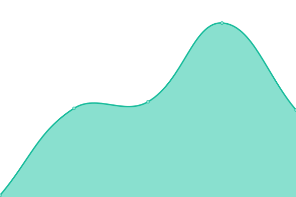
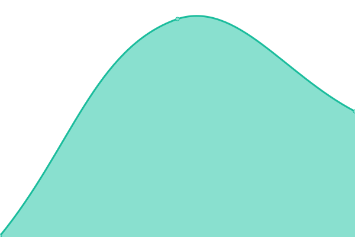

# [📈 Live Status](https://designedbycave.co.uk): <!--live status--> **🟧 Partial outage**

This repository contains the open-source uptime monitor and status page for [George Cave](https://www.designedbycave.co.uk), powered by [Upptime](https://github.com/upptime/upptime).

With [Upptime](https://upptime.js.org), you can get your own unlimited and free uptime monitor and status page, powered entirely by a GitHub repository. We use [Issues](https://github.com/gcsalzburg/upptime/issues) as incident reports, [Actions](https://github.com/gcsalzburg/upptime/actions) as uptime monitors, and [Pages](https://designedbycave.co.uk) for the status page.

<!--start: status pages-->
<!-- This summary is generated by Upptime (https://github.com/upptime/upptime) -->
<!-- Do not edit this manually, your changes will be overwritten -->

| URL                                             | Status  | History                                                                                         | Response Time                                                                    | Uptime                                                                                                                                                                                                               |
| ----------------------------------------------- | ------- | ----------------------------------------------------------------------------------------------- | -------------------------------------------------------------------------------- | -------------------------------------------------------------------------------------------------------------------------------------------------------------------------------------------------------------------- |
| [Google](https://www.google.com)                | 🟩 Up   | [google.yml](https://github.com/gcsalzburg/upptime/commits/master/history/google.yml)           |  43ms       |            |
| [KISKA](https://www.kiska.com)                  | 🟩 Up   | [kiska.yml](https://github.com/gcsalzburg/upptime/commits/master/history/kiska.yml)             |  799ms       |              |
| [Wikipedia](https://en.wikipedia.org)           | 🟩 Up   | [wikipedia.yml](https://github.com/gcsalzburg/upptime/commits/master/history/wikipedia.yml)     |  79ms    |      |
| [Hacker News](https://news.ycombinator.com)     | 🟩 Up   | [hacker-news.yml](https://github.com/gcsalzburg/upptime/commits/master/history/hacker-news.yml) |  310ms |  |
| [Broken Site](https://thissitedoesnotexist.com) | 🟥 Down | [broken-site.yml](https://github.com/gcsalzburg/upptime/commits/master/history/broken-site.yml) |  0ms   |   |

<!--end: status pages-->

[**Visit our status website →**](https://designedbycave.co.uk)

## 📄 License

- Code: [MIT](./LICENSE) © [George Cave](https://www.designedbycave.co.uk)
- Data in the `./history` directory: [Open Database License](https://opendatacommons.org/licenses/odbl/1-0/)
