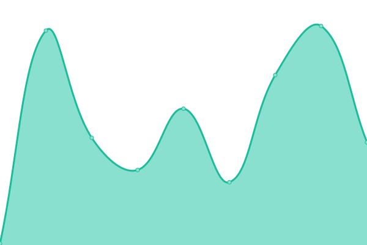
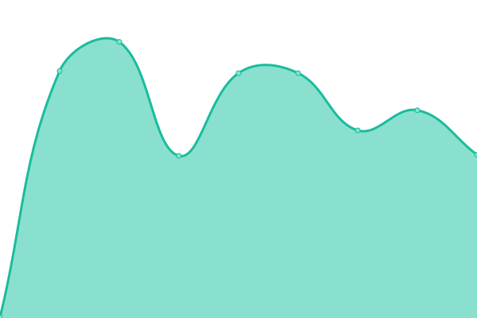
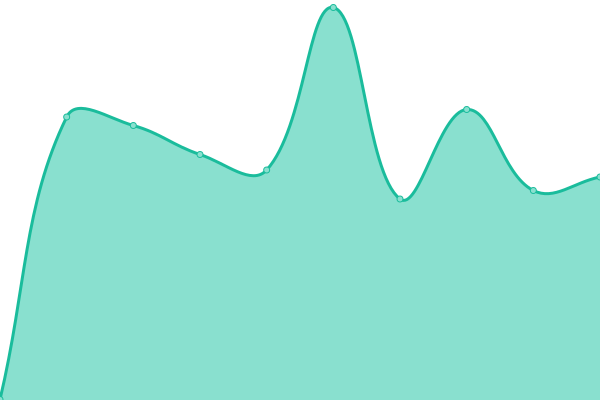

# [📈 Live Status](https://designedbycave.co.uk): <!--live status--> **🟧 Partial outage**

This repository contains the open-source uptime monitor and status page for [George Cave](https://www.designedbycave.co.uk), powered by [Upptime](https://github.com/upptime/upptime).

With [Upptime](https://upptime.js.org), you can get your own unlimited and free uptime monitor and status page, powered entirely by a GitHub repository. We use [Issues](https://github.com/gcsalzburg/upptime/issues) as incident reports, [Actions](https://github.com/gcsalzburg/upptime/actions) as uptime monitors, and [Pages](https://designedbycave.co.uk) for the status page.

<!--start: status pages-->
<!-- This summary is generated by Upptime (https://github.com/upptime/upptime) -->
<!-- Do not edit this manually, your changes will be overwritten -->
<!-- prettier-ignore -->
| URL | Status | History | Response Time | Uptime |
| --- | ------ | ------- | ------------- | ------ |
|  [67hours](https://www.67hours.co.uk) | 🟩 Up | [67hours.yml](https://github.com/gcsalzburg/upptime/commits/HEAD/history/67hours.yml) | 

 640ms
     
 | 

<a href="https://gcsalzburg.github.io/upptime/history/67hours">98.73%</a>
    

|  [designedbycave](https://www.designedbycave.co.uk) | 🟥 Down | [designedbycave.yml](https://github.com/gcsalzburg/upptime/commits/HEAD/history/designedbycave.yml) | 

 80ms
     
 | 

<a href="https://gcsalzburg.github.io/upptime/history/designedbycave">99.99%</a>
    

|  [CAVE Languages](https://www.cavelanguages.co.uk) | 🟩 Up | [cave-languages.yml](https://github.com/gcsalzburg/upptime/commits/HEAD/history/cave-languages.yml) | 

 433ms
     
 | 

<a href="https://gcsalzburg.github.io/upptime/history/cave-languages">98.74%</a>
    

|  [Doug Cave](https://www.dougcave.co.uk) | 🟥 Down | [doug-cave.yml](https://github.com/gcsalzburg/upptime/commits/HEAD/history/doug-cave.yml) | 

 529ms
     
 | 

<a href="https://gcsalzburg.github.io/upptime/history/doug-cave">98.74%</a>
    

|  [KISKA](https://www.kiska.com) | 🟩 Up | [kiska.yml](https://github.com/gcsalzburg/upptime/commits/HEAD/history/kiska.yml) | 

 922ms
     
 | 

<a href="https://gcsalzburg.github.io/upptime/history/kiska">99.65%</a>
    

<!--end: status pages-->

[**Visit our status website →**](https://designedbycave.co.uk)

## 📄 License

- Code: [MIT](./LICENSE) © [George Cave](https://www.designedbycave.co.uk)
- Data in the `./history` directory: [Open Database License](https://opendatacommons.org/licenses/odbl/1-0/)
