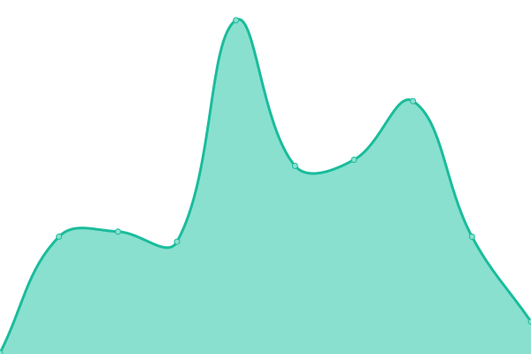
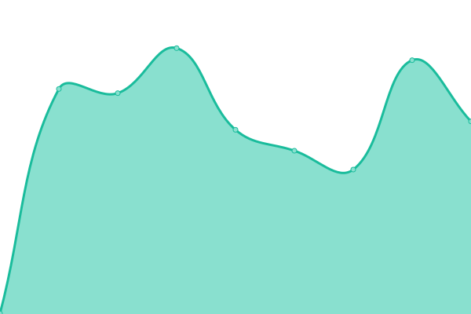
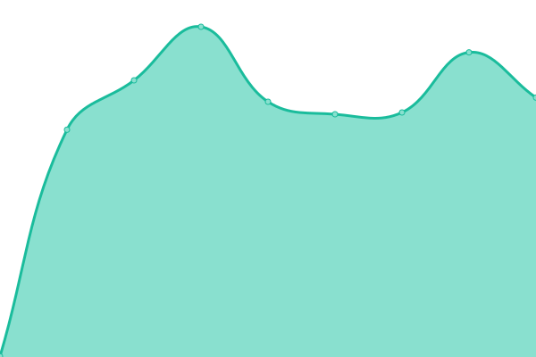

# [📈 Live Status](https://designedbycave.co.uk): <!--live status--> **🟧 Partial outage**

This repository contains the open-source uptime monitor and status page for [George Cave](https://www.designedbycave.co.uk), powered by [Upptime](https://github.com/upptime/upptime).

With [Upptime](https://upptime.js.org), you can get your own unlimited and free uptime monitor and status page, powered entirely by a GitHub repository. We use [Issues](https://github.com/gcsalzburg/upptime/issues) as incident reports, [Actions](https://github.com/gcsalzburg/upptime/actions) as uptime monitors, and [Pages](https://designedbycave.co.uk) for the status page.

<!--start: status pages-->
<!-- This summary is generated by Upptime (https://github.com/upptime/upptime) -->
<!-- Do not edit this manually, your changes will be overwritten -->

| URL                                                | Status  | History                                                                                               | Response Time                                                                       | Uptime                                                                                                                                                                                                                             |
| -------------------------------------------------- | ------- | ----------------------------------------------------------------------------------------------------- | ----------------------------------------------------------------------------------- | ---------------------------------------------------------------------------------------------------------------------------------------------------------------------------------------------------------------------------------- |
| [67hours](https://www.67hours.co.uk)               | 🟩 Up   | [67hours.yml](https://github.com/gcsalzburg/upptime/commits/master/history/67hours.yml)               |  498ms        |                |
| [designedbycave](https://www.designedbycave.co.uk) | 🟥 Down | [designedbycave.yml](https://github.com/gcsalzburg/upptime/commits/master/history/designedbycave.yml) |  162ms |   |
| [CAVE Languages](https://www.cavelanguages.co.uk)  | 🟩 Up   | [cave-languages.yml](https://github.com/gcsalzburg/upptime/commits/master/history/cave-languages.yml) |  355ms |  |
| [Doug Cave](https://www.dougcave.co.uk)            | 🟩 Up   | [doug-cave.yml](https://github.com/gcsalzburg/upptime/commits/master/history/doug-cave.yml)           |  454ms      |            |
| [KISKA](https://www.kiska.com)                     | 🟩 Up   | [kiska.yml](https://github.com/gcsalzburg/upptime/commits/master/history/kiska.yml)                   |  949ms          |                    |

<!--end: status pages-->

[**Visit our status website →**](https://designedbycave.co.uk)

## 📄 License

- Code: [MIT](./LICENSE) © [George Cave](https://www.designedbycave.co.uk)
- Data in the `./history` directory: [Open Database License](https://opendatacommons.org/licenses/odbl/1-0/)
